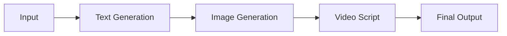

# AI Tools

Comprehensive guide to AI-powered tools for content creation, analysis, and automation.

---

## Overview

This section covers essential AI tools that complement your chatbot implementations, providing specialized functionality for various content creation and analysis tasks.

---

## Content Creation Tools

### Text-to-Image Generation

Transform text descriptions into stunning visuals using AI image generators:

**Supported Platforms:**
- DALL-E 3 (OpenAI)
- Midjourney
- Stable Diffusion
- Adobe Firefly
- Gemini Imagen

**Use Cases:**
- Blog post illustrations
- Social media graphics
- Concept art
- Marketing materials
- Educational diagrams

**Prompt Engineering Tips:**

!!! tip "Effective Image Prompts"
    ```
    Subject + Style + Lighting + Composition + Details
    
    Example:
    "A professional photographer capturing sunset, 
    cinematic style, golden hour lighting, 
    rule of thirds composition, 
    Canon EOS R8, shallow depth of field"
    ```

---

### AI Roleplay Writer

Create compelling character interactions and dialogue:

**Applications:**
- Interactive storytelling
- Training scenarios
- Educational simulations
- Game development
- Customer service training

**Key Features:**
- Character personality modeling
- Context-aware responses
- Multi-turn dialogue management
- Emotional intelligence
- Scenario branching

**Best Practices:**

```markdown
## Character Definition Template

**Name:** [Character Name]
**Role:** [Primary function]
**Personality:** [Key traits]
**Background:** [Relevant history]
**Speaking Style:** [Communication patterns]
**Goals:** [Motivations]
**Constraints:** [Limitations/boundaries]
```

---

### Chatbot Prompt Generator

Optimize prompts for maximum effectiveness:

**Components:**
1. **System Instructions** - Define AI behavior
2. **Context Setting** - Provide background
3. **Task Definition** - Clear objectives
4. **Output Format** - Desired structure
5. **Constraints** - Boundaries and rules

**Prompt Structure:**

```
[Role] You are a [specific role] specialized in [domain]

[Context] Working with [context details]

[Task] Your task is to [clear objective]

[Format] Provide output as [structure]

[Constraints] Ensure [requirements and limitations]
```

---

### Video Script Writer

Generate professional video scripts:

**Script Types:**
- YouTube videos
- Training materials
- Promotional content
- Documentaries
- News segments
- Tutorial videos

**Script Template:**

```markdown
# [Video Title]

## Metadata
- Duration: [Target length]
- Target Audience: [Demographics]
- Platform: [YouTube/Vimeo/etc]
- Style: [Educational/Entertainment/etc]

## Hook (0:00-0:15)
[Opening line that grabs attention]

## Introduction (0:15-0:45)
[Introduce topic and what viewers will learn]

## Main Content (0:45-X:XX)
### Section 1: [Topic]
- Visual: [What's on screen]
- Audio: [Narration]
- B-Roll: [Supporting footage]

### Section 2: [Topic]
[Continue structure]

## Conclusion (X:XX-End)
[Summary and call-to-action]

## Technical Notes
- Music: [Style/tempo]
- Graphics: [Text overlays, animations]
- Transitions: [Style preferences]
```

---

## AI Analysis Tools

### Content Analyzer

Evaluate content quality and effectiveness:

**Metrics:**
- Readability scores
- SEO optimization
- Tone analysis
- Grammar and style
- Engagement potential

### Fact-Checking Assistant

Verify information accuracy:

**Capabilities:**
- Source verification
- Cross-reference checking
- Date validation
- Expert opinion matching
- Bias detection

---

## Automation Tools

### Batch Processing

Automate repetitive content tasks:

```python
# Example: Batch image description generator
for image in image_list:
    description = ai.analyze_image(image)
    metadata = ai.extract_metadata(image)
    save_results(description, metadata)
```

### Content Scheduling

Plan and automate content distribution:

**Features:**
- Multi-platform posting
- Optimal timing analysis
- A/B testing
- Performance tracking
- Auto-optimization

---

## Integration Workflows

### Cross-Tool Integration

Combine multiple AI tools for enhanced results:



### API Integration

Connect tools programmatically:

```python
# Example workflow
text = chatgpt.generate(prompt)
image = dalle.create(text_to_image_prompt(text))
script = claude.format_script(text, image_description)
```

---

## Best Practices

!!! warning "Quality Control"
    Always review AI-generated content before publication. AI tools assist but don't replace human judgment.

!!! info "Ethical Considerations"
    - Disclose AI-generated content when appropriate
    - Respect copyright and intellectual property
    - Ensure accuracy in factual content
    - Consider bias in AI outputs

!!! success "Optimization Tips"
    - Test multiple prompt variations
    - Iterate based on results
    - Document successful patterns
    - Share learnings with team

---

## Tool Comparison

| Tool | Best For | Pricing | Learning Curve |
|------|----------|---------|----------------|
| **ChatGPT** | Text generation | Tiered | Low |
| **DALL-E** | Image creation | Per image | Low |
| **Midjourney** | Artistic images | Subscription | Medium |
| **Claude** | Long-form content | Tiered | Low |
| **Gemini** | Multimodal tasks | Tiered | Low |

---

## Getting Started

1. **Identify Your Needs** - What content do you create?
2. **Choose Tools** - Select based on requirements
3. **Learn Basics** - Master fundamental techniques
4. **Practice Prompting** - Develop effective prompts
5. **Iterate & Improve** - Refine based on results

---

## Resources

### Tutorials
- [Prompt Engineering Guide](../education/prompt-engineering.md)
- [Image Generation Masterclass](../creative/image-generation.md)
- [Video Script Templates](../creative/video-scripts.md)

### Templates
- [Prompt Library](../resources/prompt-library.md)
- [Script Templates](../resources/script-templates.md)
- [Character Profiles](../resources/character-templates.md)

### Community
- [Discussion Forum](https://github.com/yourusername/VP-KB-v1/discussions)
- [Issue Tracker](https://github.com/yourusername/VP-KB-v1/issues)

---

!!! example "Real-World Example"
    **Blog Post Creation Workflow:**
    
    1. Generate outline with ChatGPT
    2. Create header images with DALL-E
    3. Write full content with Claude
    4. Generate social media posts with Gemini
    5. Schedule publication with automation tool

---

<div style="text-align: center; padding: 2rem 0;">
  <p>Ready to explore more categories?</p>
  <a href="../categories/" class="md-button md-button--primary">View All Categories</a>
</div>
